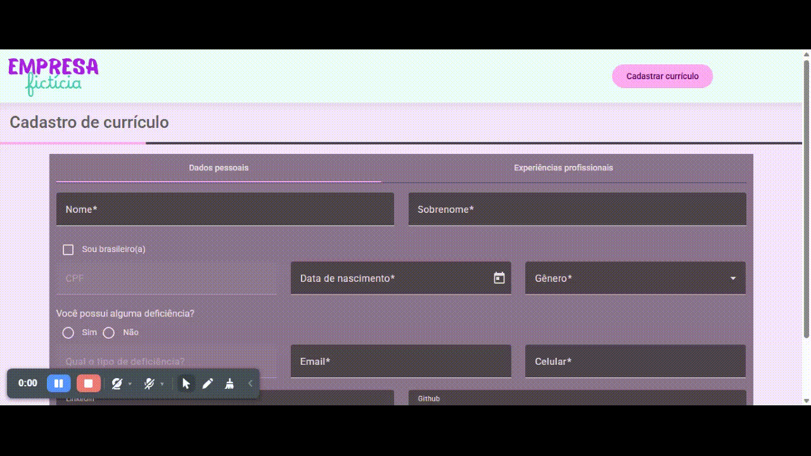
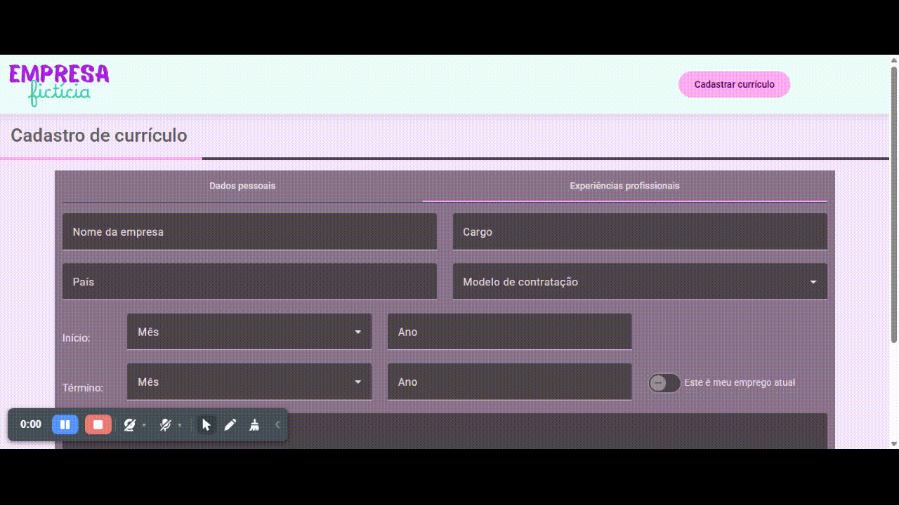

# :briefcase: Cadastro de currículos em Empresa Fictícia

Um projeto simulando uma empresa fictícia, na qual seu nome também é Empresa Fictícia, onde disponibiliza um formulário de cadastro, com alguns campos pessoais obrigatórios e campos de experiência profissional ilimitados.
Estes campos são salvos em Local Storage, mas o usuário também pode apagá-los.

A intenção desta funcionalidade é mostrar meus conhecimentos no Angular junto com o Angular Material no uso de componentes da biblioteca, e usando também o Boostrap no seu sistema de grade para tentar atender ao máximo na responsividade do projeto.

## :desktop_computer: Preview

### Tela inicial


### Formulário de dados pessoais



### Formulário de experiências profissionais



## :pushpin: Instruções de instalação e execução

**Antes de tudo**

Para conseguir rodar o projeto é necessário ter o Node.js na versão 18.20.7 ou superior, e o Angular na versão 19.2.5 ou superior.

**Primeiro: clone o repositório**

```bash
git clone https://github.com/miathayde/radix-challenge.git
```

**Segundo: instale as dependências do projeto**

```bash
npm install
```

**Terceiro: rode o projeto**

```bash
ng serve
```

E então acessar o projeto na seguinte URL: 

```bash
http://localhost:4200/
```

## :hammer_and_wrench: Melhorias para o futuro

- Correção da barra de progresso atendendo de maneira correta ao preenchimento dos campos do formulário.
- Campos 'LinkedIn' e 'GitHub' não permitindo apagar o link do site, deixando apenas completar o formulário com o seu usuário.
- Dados sendo salvos em JSON dentro do projeto.
- Criação de tela exibindo vagas fictícias e transformando o atual formulário em um 'Banco de Talentos'.
- Tela de login para funcionários.
- Cadastro de novas vagas e possibilitando criação de formulários próprios para cada vaga.
